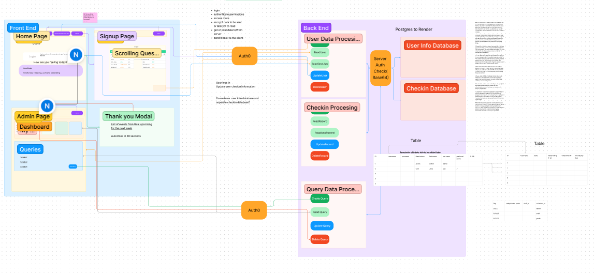

# Mid-Term CodeFellows 401 Project

## Project: Helen House Application: Backend

### Authors

- [Francisco Sanchez](https://github.com/c0d3cisco)
- [Heather Holcomb](https://github.com/holcombheather)
- [Katherine Lee](https://github.com/KatiLee)
- [Malik Sadiki-Torres](https://github.com/MalikTorres)
- [Nick Mullaney](https://github.com/nickmullaney)
- [Ike Steoger](https://github.com/IkeSteoger)

### Problem Domain

The problem we’re solving is the need for a secure and efficient database application that can handle large amounts of demographic data, simplify the process of collecting this information, and provide easy querying for Helen House, a rural LGBTQ+ youth center. This solution will not only digitize their current paper-based data collection but also enhance data accuracy, accessibility, and the ability to generate insights for grant applications.

### Links and Resources

- [Trello](https://trello.com/invite/b/KisbuKmx/ATTI8636c0c7dd7edb956f96bd8d8b9555f89A203B63/agile-board-template-trello)
- [GitHub Actions ci/cd](https://github.com/MissionDrivenDevs/helen-house-backend/actions)
- [UML & Wireframe Figjam](https://www.figma.com/file/3gpv4BCuYd3Oa3jwod3ynt/Helen-House-Backend?type=whiteboard&node-id=0-1&t=eQPdLm5eGrAcrUL8-0)
- [Team Agreement](./teamAgreement.md)
- [Requirements](./requirements.md)
<!-- - [back-end dev server url]() -->
<!-- - [back-end prod server url]() -->

### Collaborators

- Thanks to the Helen House Project Team for giving us the opportunity to work on this incredible project.
- Thanks to Tylene, Ryan, Sara, & Amanda for the collaborative input
- Thanks to ChatGPT for assisting with some code corrections and testing features.

### Setup

#### How to initialize/run your application

Clone repo, `npm i`, alter `.env.sample` into `.env` and make any needed changes, `npm start`.

### Installation and Setup

1. Clone the repository:

   ```bash
   git clone https://github.com/MissionDrivenDevs/helen-house-backend
   ```

2. Install dependencies:

   ```bash
   npm i
   ```

To use Postgres and SQLite databases with the application, please follow the steps below:

#### Postgres & SQLite

1. Create a new database for the project using `db:config` and then create a local database `db:create`
3. Update the `.config` file so that it looks like this.
   ``` json
   "development": {
    "username": "your-username",
    "password": null,
    "database": "helen_house_backend",
    "host": "127.0.0.1",
    "dialect": "postgres"
   },
   "test": {
    "username": "root",
    "password": null,
    "database": "database_test",
    "host": "127.0.0.1",
    "dialect": "mysql"
   },
   "production": {
    "username": "root",
    "password": null,
    "database": "database_production",
    "host": "127.0.0.1",
    "dialect": "mysql"
   }
   ```
   
4. Update the `.env` file with the SQLite database path so it follows this format
   ```
   PORT=3001
   DATABASE_URL=postgres://localhost:5432/helen_house_backend
   SECRET=secretPath
   ```

### Key Notes

Type `clear all` into the terminal while running `nodemon` to clear your local database, this is useful if you need to start over or change a model locally.

#### Tests

To run tests, after running `npm i`, run the command `npm test`. The tests are implemented using Jest and Supertest. The test cases are located in the `tests` directory. The tests cover the API routes and ensure the proper functioning of the backend.

### Routes

##### The application provides the following CRUD routes for basic Create, Read, Read One, Update, and Delete operations:
Update with 

- **Signup**: `POST /signup` Signup a user
- **Signin**: `POST /signin` Signin with basic auth
- **Get Users**: `GET /users` Get all users with Bearer Auth
  
- **Create userData**: `POST /api/userData` - Create a new userData.
- **Read userData**: `GET /api/userData` - Get all userData resources.
- **Read One userData**: `GET /api/userData/:id` - Get a specific userData resource by ID.
- **Update userData**: `PUT /api/userData/:id` - Update a specific resource by ID.
- **Delete userData**: `DELETE /api/userData/:id` - Delete a specific resource by ID.
  
- **Create checkinData**: `POST /api/checkinData` - Create a new userData.
- **Read checkinData**: `GET /api/checkinData` - Get all userData resources.
- **Read One checkinData**: `GET /api/checkinData/:id` - Get a specific userData resource by ID.
- **Update checkinData**: `PUT /api/checkinData/:id` - Update a specific resource by ID.
- **Delete checkinData**: `DELETE /api/checkinData/:id` - Delete a specific resource by ID.

##### Additional custom routes available in the application are:

- **Get Users with UserData**: `GET /UserWithData` - Get all users with associated UserData.
- **Get Users with CheckinData**: `GET /UserWithCheckin` - Get all users with associated CheckinData.
- **Get User with CheckinData**: `GET /UserWithCheckin/:id` - Get a specific user with associated CheckinData by ID.

##### Query Routes

- **Checkin Query**: `GET /checkinquery` - Perform a query on check-in data to find the total time all users spent during a single day or date range at Helen House. 
  Be sure to add in a query parameter for:
  - date_start YYYY-MM-DD
  - and optional date_end YYYY-MM-DD
- **Checkin Query by User**: `GET /checkinquery/:id` - Perform a query on check-in data to find the total time a specific user spent during a single day or date range at Helen House.
 Be sure to add in a query parameter for:
  - date_start YYYY-MM-DD
  - and optional date_end YYYY-MM-DD
- **Average Checkin Time**: `GET /checkinAverage` - Perform a query on check-in data to find the average time all users spent during a single day or date range at Helen House.
  Be sure to add in a query parameter for:
  - date_start YYYY-MM-DD
  - and optional date_end YYYY-MM-DD

### Testing and Program Flow

The application allows users to log in and post information to either the Checkin Database Table or the UserData Database Table in Postgres. The application is hosted on render.com.

#### User Flow

1. Users sign up and create their own username, which will be stored in the UserData database table.
2. Users log in and update the Checkin Database Table every time they log in.
3. The application also provides an admin functionality. Admins can log in and query all the data from the two tables to build different search queries based on their parameters.

#### Data Flow

1. Users sign up and their username is stored in the `users` table. 
2. Users enter their personal information into the `userData` table 
3. Users log in and update the Checkin Database Table with their check-in information.
4. Admins can log in and query the user, userData and checkinData tables to retrieve data based on their search criteria.

### UML


